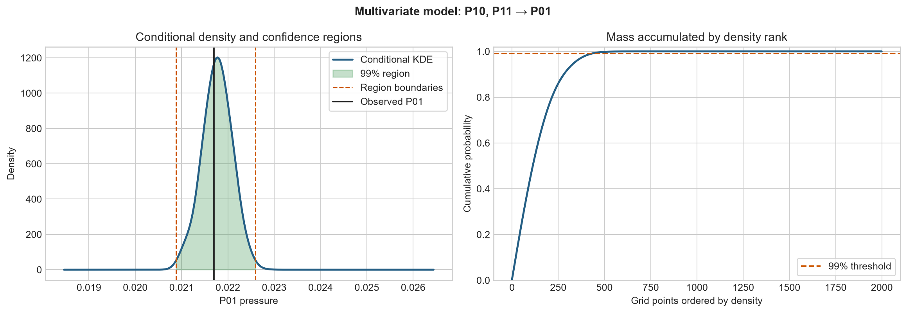
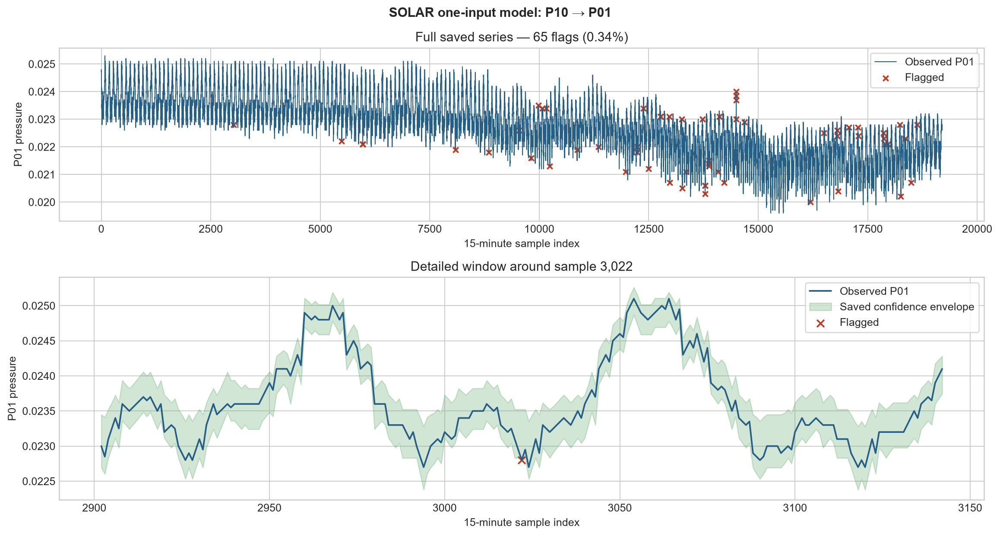

# SOLAR

**Statistical Optimisation for Localised Anomaly Recognition**

SOLAR is my Imperial College London BEng individual project on anomaly detection in gas distribution networks. I built non-parametric, multivariate models that learn how a target pressure sensor normally behaves given readings from correlated sensors, then flag observations outside context-dependent confidence regions.

The project demonstrates statistical modelling, multivariate time-series analysis, scientific Python and technical visualisation using Jupyter, NumPy, pandas, SciPy and Matplotlib. In controlled tests, the saved P10 → P01 model detected every deliberately injected synthetic anomaly; this validates the experimental pipeline rather than claiming complete real-world fault coverage.

## What I built

- A preprocessing methodology for a 27-location, 15-minute gas-network dataset, including gap analysis and correlation-assisted imputation.
- Exploratory analysis of intraday behaviour, seasonal change and inter-sensor dependencies.
- Correlation-based selection of candidate input sensors where network topology was unavailable.
- One- to five-input conditional kernel-density models for target pressure sensors.
- Context-dependent confidence regions formed by accumulating the highest-density output values to a chosen probability threshold.
- Controlled evaluation using amplitude, transient and persistent synthetic anomalies.

The notebooks concentrate on the conditional KDE and evaluation stages. This README summarises the preceding preprocessing, behavioural analysis and lag-correlation investigation.

## Representative result

The saved P10 → P01 model contains 19,201 observations and flags 65 points (0.339%) in the original series. These saved outputs predate the later disjoint-region integration and use the original outer lower/upper-bound rule. Applying those same bounds to the supplied synthetic datasets gives:

| Synthetic anomaly | Injected points | Precision | Recall | F1 |
| --- | ---: | ---: | ---: | ---: |
| Amplitude | 192 | 0.750 | 1.000 | 0.857 |
| Persistent | 181 | 0.736 | 1.000 | 0.848 |
| Transient | 192 | 0.747 | 1.000 | 0.855 |

These anomalies were deliberately injected far enough from normal behaviour to cross the learned limits. The 100% recall is therefore evidence that the controlled test worked, not evidence of complete real-world fault coverage. Precision includes points already flagged in the unmodified series.

## Method

### Expected behaviour

For a target sensor Y and a vector of correlated sensor readings x_q, SOLAR:

1. Measures the Euclidean distance between x_q and historical input vectors.
2. Applies a Gaussian input kernel to give greater weight to similar historical network states.
3. Uses those weights in an output kernel-density estimate of f(y | x_q).
4. Selects the highest-density grid values until the requested probability mass, normally 99%, is reached.
5. Flags an observed target value if it lies outside every selected interval.

Unlike a single symmetric interval, this highest-density construction can produce multiple disjoint regions. It can therefore preserve low-density gaps between modes rather than treating the entire outer min/max envelope as normal.

### Seasonal and behavioural patterns

The exploratory analysis found strong intraday variation and change across the January-to-July observation period. Temperature-pressure relationships also changed between colder and warmer periods. These findings motivated a non-parametric model rather than a fixed linear or Gaussian assumption.

The available history covers only about six and a half months, so the project does not claim a robust annual seasonal model. Longer-term seasonality and external features remain future work.

### Correlation and time lag

Pairwise Pearson correlations were used to identify candidate sensor dependencies and to support imputation. The report also compares simultaneous and 15-minute-lagged readings to investigate propagation delays. The current model notebook consumes the precomputed zero-lag correlation table; it does not reproduce a full cross-correlation or lag-optimisation pipeline.

### Local and network-level interpretation

Each implemented model produces a sensor-specific anomaly decision conditioned on one or more other sensors. A local flag indicates that a target reading is unusual for the observed network context.

The report discusses stronger evidence for a network-level disturbance when temporally aligned deviations occur across related upstream and downstream sensors. That aggregation is an interpretation framework and future extension, not an automated network-wide classifier in the current notebooks.

## Repository structure

~~~text
.
├── assets/
│   ├── conditional-confidence-regions.png
│   └── p01-p10-anomaly-detection.png
├── train_kde_models.ipynb
├── visualise_model_outputs.ipynb
├── requirements.txt
└── README.md
~~~

The proposed public repository excludes the partner-supplied operational workbook and data-derived CSVs unless redistribution permission is confirmed. The notebooks still support authorised local copies.

## Run locally

Python 3.10 or newer is recommended.

~~~bash
python -m venv .venv
.venv\Scripts\activate
python -m pip install -r requirements.txt
jupyter lab
~~~

Open train_kde_models.ipynb from the repository root. By default it looks for:

~~~text
march_26_data_corrected_table.xlsx
highly_correlated_sensors.csv
~~~

The operational workbook can instead be supplied through SOLAR_DATA_PATH:

~~~powershell
$env:SOLAR_DATA_PATH = "C:\path\to\authorised\march_26_data_corrected_table.xlsx"
~~~

train_kde_models.ipynb runs one representative two-input query by default. Full batch generation is opt-in because the original 19,201-query × 10,000-grid formulation is computationally and memory intensive.

visualise_model_outputs.ipynb reads the saved P01 model output and synthetic test CSVs. Those data-derived files are not intended for the public release without permission.

## Technologies

Python, Jupyter, NumPy, pandas, SciPy, Matplotlib and openpyxl.

## Limitations

- Evaluation uses deliberately strong synthetic anomalies because labelled real faults were unavailable.
- The fixed Silverman bandwidth is sensitive to local density and can over- or under-smooth complex regions.
- Dense kernel evaluation is expensive and currently suited to offline analysis.
- Correlation does not establish physical network adjacency or gas-flow direction.
- The available data do not support a complete annual seasonal analysis.
- Statistical flags require interpretation by engineers and are not operational instructions.

## Project provenance

This repository presents work completed for my 2025 Imperial College London BEng individual project, with subsequent integration of a later multivariate confidence-region and visualisation update. The cleanup improves clarity and reproducibility without changing the project into a production system or claiming results beyond the recorded experiments.
